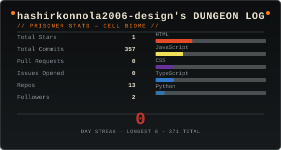

<div align="center">

# ⚔️ `THE PRISONER`

### **HASHIR MUHIYUDHEEN KONNOLA**

`Frontend Developer` · `Code Explorer` · `Professional Bug Hunter`


<br/>

`[ THE PRISONER HAS ENTERED THE PRISON ]`

</div>

---

<div align="center">

### 🏰 `THE PRISON`

```text
╔══════════════════════════════════════════════════════════════╗
║                         PRISONER                             ║
║                                                              ║
║  HASHIR                                                       ║
║  Frontend Developer                                           ║
║                                                              ║
║  Current Run:  Building web projects                         ║
║  Current Biome: Web Development                              ║
║  Current Weapon: JavaScript                                  ║
║  Current Objective: Become dangerously good at UI/UX         ║
╚══════════════════════════════════════════════════════════════╝
```

</div>

## 🧪 `PLAYER PROFILE`

> **Who is Hashir?**

I'm a Computer Science student who likes building things for the web.

Currently exploring **frontend development, modern JavaScript, UI/UX and backend technologies** while turning random ideas into actual projects.

```yaml
class:              Frontend Developer
current_level:      Learning
main_quest:         Build better products
side_quest:         Try everything
special_ability:    Turning ideas into websites
weakness:           Sleep
```

---

## 🗺️ `THE BIOMES`

### 🌿 `PROMENADE OF THE CONDEMNED`

**Frontend**

<p>


</p>

### 🏰 `STILT VILLAGE`

**Backend & Database**

<p>


</p>

### 🕯️ `OSSUARY`

**Languages**

<p>


</p>

### 🏹 `CLOCK TOWER`

**Deployment**

<p>


</p>

### 🛠️ `PASSAGE OF CRAFTSMANSHIP`

**Design & Tools**

<p>


</p>

---

## ⚔️ `THE ARSENAL`

```text
╔══════════════════════════════════════════════════════════╗
║                     CURRENT LOADOUT                      ║
╠══════════════════════════════════════════════════════════╣
║                                                          ║
║  PRIMARY      JavaScript / React                         ║
║  SECONDARY    HTML / CSS                                 ║
║  TACTICAL     UI / UX                                    ║
║  SUPPORT      Supabase / Firebase                        ║
║  HEAVY        C++ / Python                               ║
║                                                          ║
╚══════════════════════════════════════════════════════════╝
```

---

## 🧟 `CURRENT RUN`

<div align="center">

### `DEAD CELLS DUNGEON LOG`



<br/>

<sub>⚙️ Self-hosted GitHub Actions · refreshed every 6 hours</sub>

</div>

---

## 💀 `BOSS ROOM`

### `PROJECTS I'VE FOUGHT`

```text
┌──────────────────────────────────────────────────────────┐
│  🏹  WEB PROJECTS                                        │
│                                                          │
│  Portfolio sites                                         │
│  Restaurant menus                                        │
│  Civic applications                                      │
│  Experimental web projects                               │
│                                                          │
├──────────────────────────────────────────────────────────┤
│  ⚔️  CURRENT OBJECTIVE                                   │
│                                                          │
│  Build → Break → Learn → Rebuild                         │
└──────────────────────────────────────────────────────────┘
```

---

## 🏆 `THE COLLECTOR`

<div align="center">


</div>

---

## 📜 `THE PRISONER'S JOURNAL`

```text
> Explore.
> Build.
> Break things.
> Fix them.
> Learn something new.
> Repeat.
```

**Current mission:**

> Build better web experiences and keep expanding the skill tree.

**Future unlocks:**

```text
[ ] Advanced React
[ ] Modern JavaScript
[ ] Better UI/UX
[ ] Backend development
[ ] Cloud technologies
[ ] More questionable ideas
```

---

## 📡 `MERCHANT'S ROOM`

<div align="center">

<a href="https://linkedin.com/in/hashir-muhiyudheen-konnola-8342aa1b9">

</a>

<a href="mailto:hashirkonnola2006@gmail.com">

</a>

<br/><br/>


</div>

---

<div align="center">

```text
╔══════════════════════════════════════════════════╗
║                                                  ║
║       THE RUN ENDS. THE NEXT ONE BEGINS.        ║
║                                                  ║
║                 ⚔️  GG, PRISONER.                ║
║                                                  ║
╚══════════════════════════════════════════════════╝
```

<sub>Made while wandering through the Prison.</sub>

</div>
